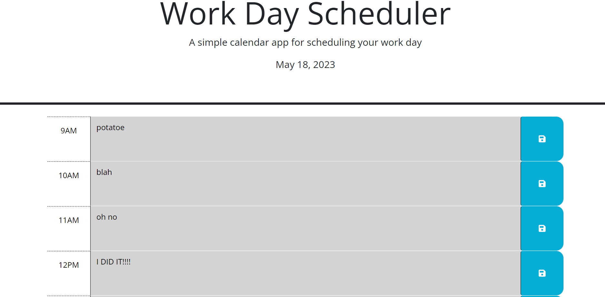

# Funk-E Work Scheduler

## Description

This website is used as a planner during regular buisness hours 9am-5pm. The scheduler can help users list "To Dos" throughout their day. The "To Dos" will stay saved so that users can close the browser then open back up to the tasks they previously entered. I created this to help user become more orgnaized about their task during thies buisness hours. I learned how to implement third party APIs.

## Table of Contents (Optional)

- [Installation](#installation)
- [Usage](#usage)
- [Credits](#credits)
- [License](#license)

## Installation

Please use the following link to open and use web application:

- 

## Usage

    ```md

    ```

## Credits

I worked with Tyreal Worley:

- https://github.com/KCGSWAGG

## License

MIT License

## Badges

none

## Features

none

## How to Contribute

none

## Tests

none